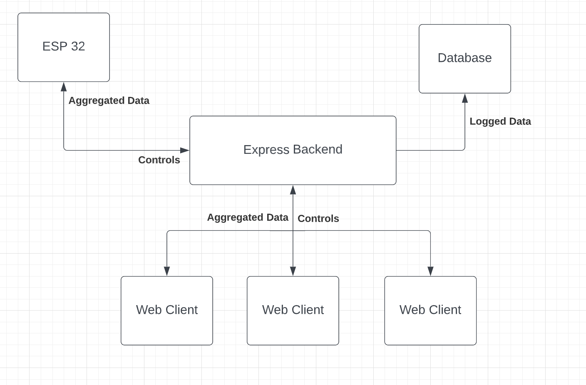

# Instrumentation Server
This will be a simple backend written with express JS and socket.io. It will facilitate the communication between micro controllers, web clients, and a database. To do so, it will:
- Receive information aggregated by the micro-controller through a web-socket
- Process this data and serve it to any web clients
	- Create graphs / visualizations for data
- Log data for storage
- Receive client requests to update the state of the device
	- Control pumps

For more information regarding the micro-controller or web client, please visit the respective sections of the repository.

## API Endpoints:
# "/"
Serves index.html. Currently a dev page, will be replaced once the client app is developed.

# SOCKET.IO - "brew-update"
Microcontroller -> Server
Provides an update containing

