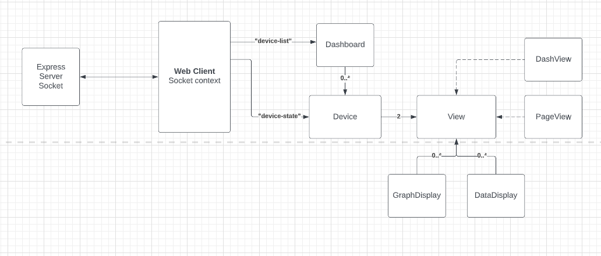

# Web Client
This is a React application that facilitates a user's interaction with the instrumentation system. The application allows the user to view and edit the current "state" of all connected brew-devices.

At a high level, this application exists as a framework to support and facilitate instrumentation at BIOT. The app is structured to allow developers to experiment with and design custom interfaces for viewing and interacting with data. 

 - Allows us to easily set up and design instrumentation tools for various projects
 

## General Operation
The server keeps track of every connected brew-device. Upon connecting to the socket, the web-client will request a copy of this list and subscribe to updates. Then, for each device, it will subscribe to updates about the device's state from the server. Using this data, the web client will render a DashView component for each device on the main page. The DashView provides a compressed view of the device's state. A user can click on any DashView component for an expanded PageView.

The following diagram represents the Component structure of the system and it's interactions with the socket api.
