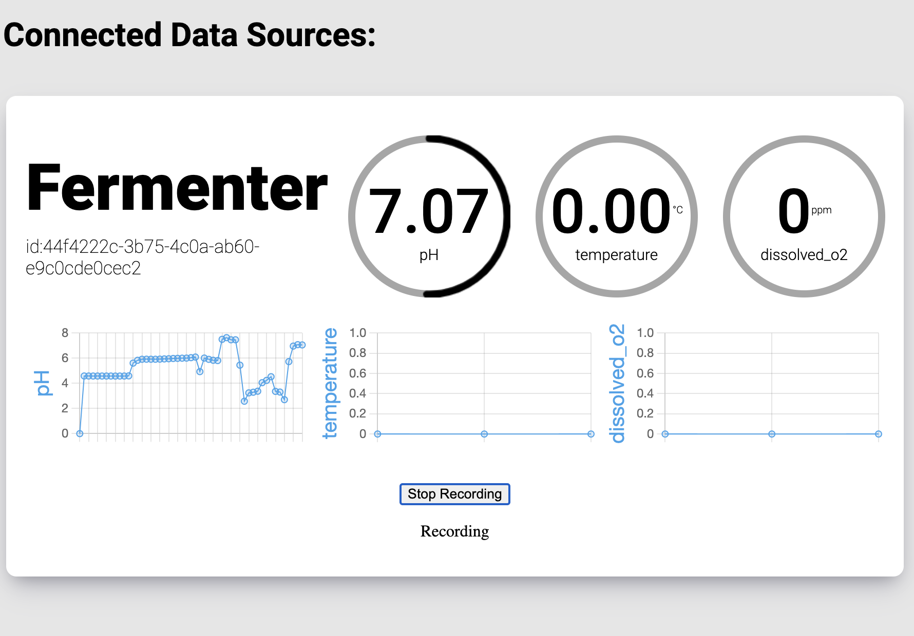

<!-- Header -->

  

<!-- Links/Socials -->

  
  

<!-- Intro -->

<h1 align="left">UBC Envision - Brewing Internet of Things</h1>
This is the repository for BIoT’s instrumentation team at the University of British Columbia. This repository is a comprehensive receptacle for storing the team’s instrumentation projects. In here, documentation and code can be found for sensing various things such as temperature, acidity, gravity, and other things. The main goal is to interface these sensors into an online webserver, being able to be accessed from anywhere, while still remaining at a cost low enough for homebrewers and small brewing companies.

# General Information

### This is the source repository for the development of BIOT's instrumentation System
At a high level, this is the design of our system.

Sensor and pump data from the brew are aggregated by an ESP32 Microcontroller. This controller opens a websocket connection with our server. Through said connection, live data is streamed regarding the "state" of the brew. Currently, we monitor Ph, temperature and dissolved oxygen. The backend is able to relay this data to a browser client through another websocket. It also stores the data to a local buffer, and stores it in a database for later reference.

### Guidelines
This page only exists to provide an overview of the project and contain information regarding the system as a whole. For more specific details and implementations, please visit the respective directories above. 

When contributing, please make sure to document all of your work thoroughly.